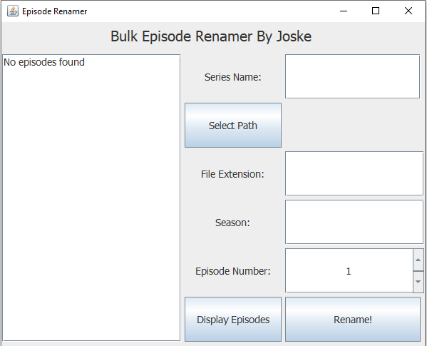
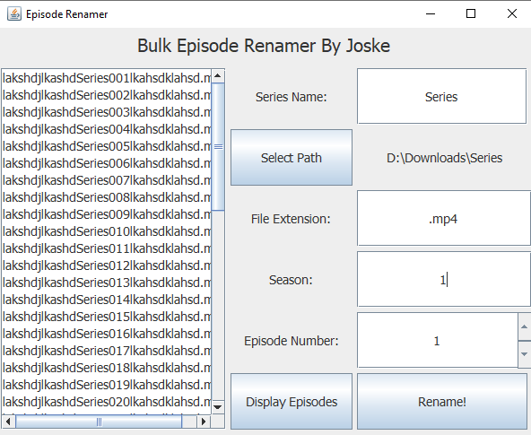
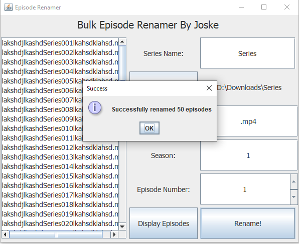

# EpisodeRenamer
Bulk renames episodes

# Screenshots
 ## Screenshot 1
 
 ## Screenshot 2
 
 ## Screenshot 3
 

# Download latest compiled version
 - [Latest release](https://github.com/Joske28/EpisodeRenamer/releases/latest)

 
# Notes
 - Only tested on windows, however, it should work on other operating systems which support java (I kept the code very general).
 - Make sure to check the 'display episodes' to ensure that they are renamed in the correct order. It renames them top down in the list.
	- The order is based on the numbers in the filename.
 - UI is minimalistic and using basic swing.
 - The episode number is the number to use as the starting number.
	- E.g., Using 5, would rename all episodes to this: Series-S1E5, Series-S1E6, Series-S1E7, etc...

# Renaming format
 - [name]-S[season]E[episode number][fileExtension]
 
# License
 - [MIT](LICENSE)
